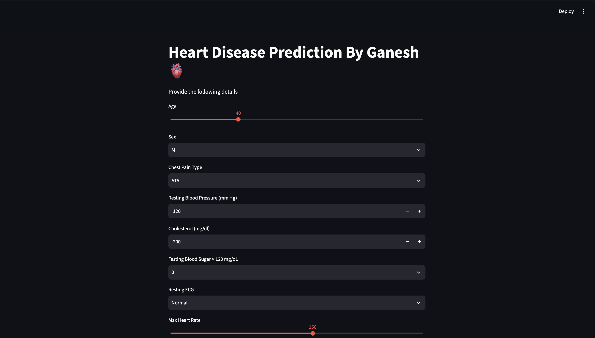

# 🫀 Heart Disease Prediction — ML (KNN) + Streamlit

A machine learning web app that predicts the likelihood of heart disease based on a patient's clinical data. The model is a **K-Nearest Neighbors (KNN)** classifier trained on the classic Heart Disease dataset, wrapped in an interactive **Streamlit** interface for real-time predictions.

## 📸 Preview



## 🚀 Features

- Predicts whether a person is likely to have heart disease based on medical input parameters
- Uses a **KNN classifier** trained on the UCI Heart Disease dataset
- Clean, interactive **Streamlit** UI for entering patient details
- Feature scaling handled with a pre-fitted scaler for consistent predictions
- Instant results — no server setup required to use the app

## 🧠 How It Works

1. The model was trained on `heart.csv` using scikit-learn's `KNeighborsClassifier` (see `HeartDisease.ipynb` for the full training and evaluation process).
2. Input features are scaled using a saved `StandardScaler` (`scaler.pkl`) to match the scale used during training.
3. The trained KNN model (`knn_heart.pkl`) predicts whether the patient is at risk of heart disease.
4. `columns.pkl` ensures the input features are ordered and named exactly as the model expects.
5. Everything is served through a Streamlit app (`app.py`) so users can enter values and get instant predictions.

## 📁 Project Structure

```
Heartdiseaseprediction-ML-KNN-Streamlit/
│
├── app.py                 # Streamlit application
├── HeartDisease.ipynb      # Model training & experimentation notebook
├── heart.csv               # Dataset used for training
├── knn_heart.pkl            # Trained KNN model
├── scaler.pkl               # Fitted StandardScaler for input features
├── columns.pkl               # Expected feature column order
├── screenshots/                # Add your app screenshot(s) here
│   └── app_screenshot.png
└── README.md
```

## 🛠️ Tech Stack

- **Python**
- **scikit-learn** — model training (KNN, scaling)
- **pandas / numpy** — data handling
- **Streamlit** — web app interface
- **pickle** — model & preprocessing object serialization

## ⚙️ Installation & Setup

Clone the repository:

```bash
git clone https://github.com/ganeshhshah-jpg/Heartdiseaseprediction-ML-KNN-Streamlit.git
cd Heartdiseaseprediction-ML-KNN-Streamlit
```

Install the required dependencies:

```bash
pip install streamlit pandas numpy scikit-learn
```

Run the Streamlit app:

```bash
streamlit run app.py
```

The app will open automatically in your browser at `http://localhost:8501`.

## 🖥️ Usage

1. Launch the app using the command above.
2. Enter the patient's clinical details (age, sex, chest pain type, blood pressure, cholesterol, etc.) in the input fields.
3. Click **Predict**.
4. The app will display whether the person is likely to have heart disease, based on the trained KNN model.

## 📊 Dataset

The model is trained on the **Heart Disease dataset** (`heart.csv`), which contains clinical attributes such as:

- Age, Sex
- Chest pain type (`cp`)
- Resting blood pressure (`trestbps`)
- Serum cholesterol (`chol`)
- Fasting blood sugar (`fbs`)
- Resting ECG results (`restecg`)
- Maximum heart rate achieved (`thalach`)
- Exercise-induced angina (`exang`)
- ST depression (`oldpeak`)
- Number of major vessels (`ca`)
- Thalassemia (`thal`)
- Target (presence/absence of heart disease)

## ⚠️ Disclaimer

This project is built for **educational and demonstration purposes only**. It is **not a certified medical diagnostic tool** and should not be used as a substitute for professional medical advice, diagnosis, or treatment. Always consult a qualified healthcare provider for medical concerns.

## 🤝 Contributing

Contributions, issues, and feature requests are welcome. Feel free to check the [issues page](https://github.com/ganeshhshah-jpg/Heartdiseaseprediction-ML-KNN-Streamlit/issues) if you'd like to contribute.

## 📄 License

This project is open source. Feel free to use and modify it for your own learning purposes.

## 👤 Author

**Ganesh Shah**      
GitHub: [@ganeshhshah-jpg](https://github.com/ganeshhshah-jpg)    
Email: [ganeshhshah@gmail.com](mailto:ganeshhshah@gmail.com)

